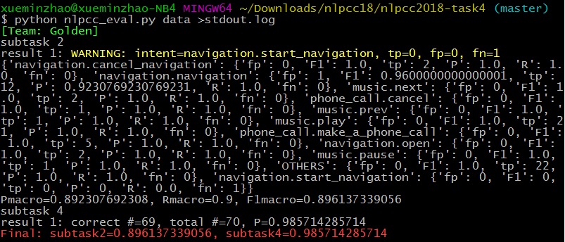

# nlpcc2018-task4

nlpcc 2018 task4 evaluation scripts.

替换`data/corpus.test.txt`为全量的测试数据，替换`Golden/task4-subtask(2|4)-result(1|2|3).txt`为全量的测试集预测输出。执行如下命令：

    python nlpcc_eval.py data >stdout.log

